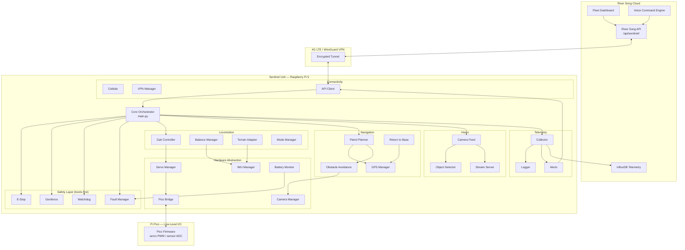
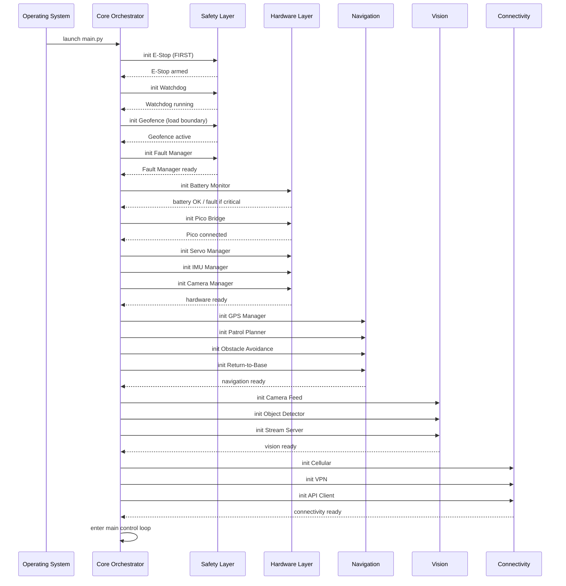
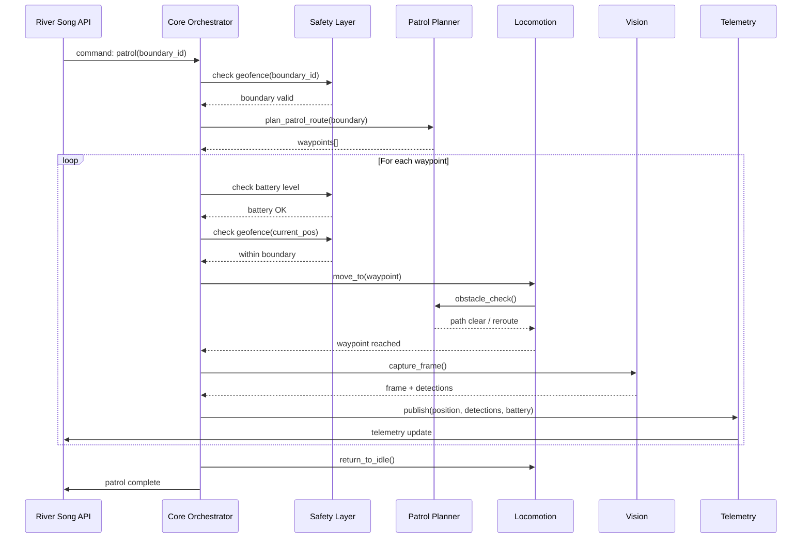
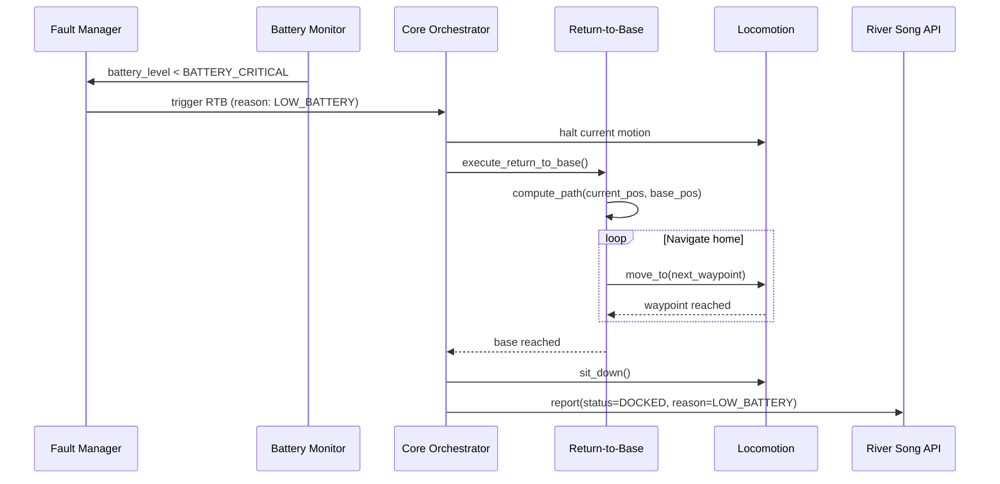

# Design Document: River Sentinel

**Project**: River Sentinel — Autonomous Quadruped Fleet Control System  
**Ecosystem**: River Song AI (riversongai.com)  
**Version**: 1.0.0  
**Author**: River Song AI Team  
**Date**: 2025

---

## Overview

River Sentinel is a production-grade autonomous quadruped robot control system built for the River Song AI ecosystem. Each Sentinel unit is a free-roaming robot dog capable of autonomous patrol within defined geofenced boundaries, real-time obstacle avoidance, live camera streaming, and full integration with the River Song voice command and dashboard infrastructure.

The system runs on a Raspberry Pi 5 (main compute) paired with a Pi Pico (low-level I/O), using ROS2 Humble as the middleware backbone. All units communicate over 4G LTE via WireGuard VPN tunnels to a central River Song API. A fleet of units can be managed from a single dashboard, each with its own patrol boundary, base location, and unit profile.

Safety is the highest architectural priority. Geofencing, emergency stop, watchdog, and fault management systems initialize before any locomotion or navigation subsystem. A unit will always return to base on low battery or fault condition, and the geofence is enforced at all times regardless of command source.


---

## Architecture

### System-Level Architecture




### Boot Sequence Architecture

Safety systems must be fully initialized and healthy before any other subsystem starts. The boot sequence is strictly ordered:




### Patrol Cycle Flow




### Return-to-Base Flow




---

## Components and Interfaces

### Core Orchestrator (`core/main.py`)

**Purpose**: Top-level ROS2 node that owns the system lifecycle. Initializes all subsystems in the correct order, runs the main control loop, and routes commands from the River Song API to the appropriate subsystem.

**Interface**:
```python
class RiverSentinelCore(Node):
    def initialize_safety_systems(self) -> None: ...
    def initialize_hardware(self) -> None: ...
    def initialize_navigation(self) -> None: ...
    def initialize_vision(self) -> None: ...
    def initialize_connectivity(self) -> None: ...
    def main_loop(self) -> None: ...
    def handle_command(self, command: SentinelCommand) -> None: ...
    def emergency_shutdown(self, reason: str) -> None: ...
```

**Responsibilities**:
- Enforce boot order: safety → hardware → navigation → vision → connectivity
- Route River Song API commands to subsystems
- Aggregate health status from all subsystems
- Trigger emergency shutdown on unrecoverable fault

---

### Safety Layer

#### E-Stop (`safety/estop.py`)

**Purpose**: Hardware and software emergency stop. Can be triggered by any subsystem or remotely via API. When triggered, all locomotion halts immediately and the unit enters a safe idle state.

**Interface**:
```python
class EStop:
    def arm(self) -> None: ...
    def trigger(self, reason: str, source: str) -> None: ...
    def reset(self, auth_token: str) -> bool: ...
    def is_triggered(self) -> bool: ...
    def get_trigger_reason(self) -> Optional[str]: ...
```

#### Geofence (`safety/geofence.py`)

**Purpose**: Enforces spatial boundaries at all times. Every navigation command is validated against the active geofence before execution. Violations trigger an immediate RTB.

**Interface**:
```python
class Geofence:
    def load_boundary(self, boundary: GeofenceBoundary) -> None: ...
    def is_within_boundary(self, position: GPSCoordinate) -> bool: ...
    def distance_to_boundary(self, position: GPSCoordinate) -> float: ...
    def validate_waypoint(self, waypoint: GPSCoordinate) -> bool: ...
    def get_active_boundary(self) -> Optional[GeofenceBoundary]: ...
```

#### Watchdog (`safety/watchdog.py`)

**Purpose**: Monitors all critical subsystems for heartbeat signals. If any subsystem misses its heartbeat window, the watchdog triggers a fault and initiates RTB.

**Interface**:
```python
class Watchdog:
    def register_subsystem(self, name: str, timeout_s: float) -> None: ...
    def heartbeat(self, subsystem_name: str) -> None: ...
    def check_all(self) -> List[str]: ...  # returns list of timed-out subsystems
    def is_healthy(self) -> bool: ...
```

#### Fault Manager (`safety/fault_manager.py`)

**Purpose**: Central fault registry. Subsystems report faults here. The fault manager determines severity and triggers appropriate responses (warn, RTB, E-Stop).

**Interface**:
```python
class FaultManager:
    def report_fault(self, fault: Fault) -> None: ...
    def get_active_faults(self) -> List[Fault]: ...
    def clear_fault(self, fault_id: str) -> bool: ...
    def highest_severity(self) -> FaultSeverity: ...
    def register_handler(self, severity: FaultSeverity, handler: Callable) -> None: ...
```


---

### Hardware Abstraction Layer

#### Servo Manager (`hardware/servo_manager.py`)

**Purpose**: Abstracts all 12 servo joints (3 per leg × 4 legs). Translates joint angle commands from the gait controller into PWM signals sent to the Pi Pico over serial.

**Interface**:
```python
class ServoManager:
    def initialize(self) -> bool: ...
    def set_joint_angle(self, joint_id: int, angle_deg: float) -> None: ...
    def set_all_joints(self, angles: List[float]) -> None: ...
    def get_joint_angle(self, joint_id: int) -> float: ...
    def enable_torque(self, joint_id: int) -> None: ...
    def disable_torque(self, joint_id: int) -> None: ...
    def emergency_relax(self) -> None: ...
```

#### IMU Manager (`hardware/imu_manager.py`)

**Purpose**: Reads orientation, angular velocity, and linear acceleration from the onboard IMU. Provides filtered pose estimates to the balance manager.

**Interface**:
```python
class IMUManager:
    def initialize(self) -> bool: ...
    def get_orientation(self) -> Quaternion: ...
    def get_angular_velocity(self) -> Vector3: ...
    def get_linear_acceleration(self) -> Vector3: ...
    def get_roll_pitch_yaw(self) -> Tuple[float, float, float]: ...
    def is_fallen(self) -> bool: ...
```

#### Battery Monitor (`hardware/battery_monitor.py`)

**Purpose**: Reads battery voltage and state of charge. Reports to the fault manager when thresholds are crossed.

**Interface**:
```python
class BatteryMonitor:
    def initialize(self) -> bool: ...
    def get_voltage(self) -> float: ...
    def get_state_of_charge(self) -> float: ...  # 0.0 - 100.0 percent
    def is_critical(self) -> bool: ...
    def is_low(self) -> bool: ...
    def get_estimated_runtime_minutes(self) -> float: ...
```

#### Pico Bridge (`hardware/pico_bridge.py`)

**Purpose**: Serial communication layer between the Raspberry Pi 5 and the Pi Pico. Sends servo commands and reads low-level sensor data (ADC, GPIO states).

**Interface**:
```python
class PicoBridge:
    def connect(self, port: str, baud_rate: int) -> bool: ...
    def disconnect(self) -> None: ...
    def send_servo_command(self, joint_id: int, pulse_us: int) -> bool: ...
    def read_adc(self, channel: int) -> float: ...
    def read_gpio(self, pin: int) -> bool: ...
    def is_connected(self) -> bool: ...
    def get_firmware_version(self) -> str: ...
```

#### Camera Manager (`hardware/camera_manager.py`)

**Purpose**: Manages the onboard camera hardware. Provides raw frame capture to the vision subsystem.

**Interface**:
```python
class CameraManager:
    def initialize(self, resolution: Tuple[int, int], fps: int) -> bool: ...
    def capture_frame(self) -> Optional[np.ndarray]: ...
    def start_stream(self) -> None: ...
    def stop_stream(self) -> None: ...
    def is_streaming(self) -> bool: ...
    def get_resolution(self) -> Tuple[int, int]: ...
```


---

### Locomotion Subsystem

#### Gait Controller (`locomotion/gait_controller.py`)

**Purpose**: Generates leg trajectories for all supported gaits (walk, trot, sit, stand). Outputs joint angle sequences to the servo manager at the configured control frequency.

**Interface**:
```python
class GaitController:
    def initialize(self) -> bool: ...
    def set_gait(self, gait: GaitType) -> None: ...
    def set_velocity(self, linear_x: float, linear_y: float, angular_z: float) -> None: ...
    def step(self) -> List[float]: ...  # returns 12 joint angles
    def halt(self) -> None: ...
    def get_current_gait(self) -> GaitType: ...
```

#### Balance Manager (`locomotion/balance_manager.py`)

**Purpose**: Reads IMU data and applies real-time corrections to joint angles to maintain stability on uneven terrain. Detects fall events and triggers fault.

**Interface**:
```python
class BalanceManager:
    def initialize(self, imu: IMUManager) -> bool: ...
    def compute_correction(self, base_angles: List[float]) -> List[float]: ...
    def is_stable(self) -> bool: ...
    def detect_fall(self) -> bool: ...
    def get_stability_score(self) -> float: ...  # 0.0 (fallen) to 1.0 (stable)
```

#### Terrain Adapter (`locomotion/terrain_adapter.py`)

**Purpose**: Classifies terrain type from IMU and camera data and adjusts gait parameters accordingly (step height, stride length, speed).

**Interface**:
```python
class TerrainAdapter:
    def classify_terrain(self, imu_data: IMUData, frame: np.ndarray) -> TerrainType: ...
    def get_gait_params(self, terrain: TerrainType) -> GaitParams: ...
    def adapt(self, controller: GaitController, terrain: TerrainType) -> None: ...
```

#### Mode Manager (`locomotion/mode_manager.py`)

**Purpose**: Manages high-level locomotion modes (IDLE, WALK, TROT, SIT, STAND, RTB). Enforces valid mode transitions and coordinates with the safety layer.

**Interface**:
```python
class ModeManager:
    def set_mode(self, mode: LocomotionMode) -> bool: ...
    def get_mode(self) -> LocomotionMode: ...
    def is_transition_valid(self, from_mode: LocomotionMode, to_mode: LocomotionMode) -> bool: ...
    def emergency_mode(self) -> None: ...
```


---

### Navigation Subsystem

#### Patrol Planner (`navigation/patrol_planner.py`)

**Purpose**: Generates an ordered list of GPS waypoints that cover the assigned patrol boundary. Supports multiple patrol patterns (perimeter, grid, random).

**Interface**:
```python
class PatrolPlanner:
    def load_boundary(self, boundary: GeofenceBoundary) -> None: ...
    def plan_route(self, pattern: PatrolPattern) -> List[GPSCoordinate]: ...
    def get_next_waypoint(self) -> Optional[GPSCoordinate]: ...
    def mark_waypoint_reached(self) -> None: ...
    def is_patrol_complete(self) -> bool: ...
    def abort(self) -> None: ...
```

#### Obstacle Avoidance (`navigation/obstacle_avoid.py`)

**Purpose**: Detects obstacles from camera and depth data and computes avoidance vectors. Integrates with the gait controller to reroute in real time.

**Interface**:
```python
class ObstacleAvoidance:
    def update(self, frame: np.ndarray, depth: Optional[np.ndarray]) -> None: ...
    def is_path_clear(self, heading: float, distance_m: float) -> bool: ...
    def get_avoidance_vector(self) -> Optional[Vector2]: ...
    def get_nearest_obstacle_distance(self) -> float: ...
```

#### Return to Base (`navigation/return_base.py`)

**Purpose**: Computes and executes the shortest safe path from the current position back to the unit's registered base location. Geofence-aware.

**Interface**:
```python
class ReturnToBase:
    def set_base_location(self, base: GPSCoordinate) -> None: ...
    def execute(self, current_pos: GPSCoordinate) -> None: ...
    def is_complete(self) -> bool: ...
    def get_distance_to_base(self) -> float: ...
    def abort(self) -> None: ...
```

#### GPS Manager (`navigation/gps_manager.py`)

**Purpose**: Reads GPS fix from the onboard GPS module. Provides current position, heading, and fix quality to navigation subsystems.

**Interface**:
```python
class GPSManager:
    def initialize(self) -> bool: ...
    def get_position(self) -> Optional[GPSCoordinate]: ...
    def get_heading(self) -> Optional[float]: ...
    def get_fix_quality(self) -> GPSFixQuality: ...
    def has_fix(self) -> bool: ...
```


---

### Vision Subsystem

#### Camera Feed (`vision/camera_feed.py`)

**Purpose**: Pulls frames from the camera manager, applies preprocessing (resize, normalize), and distributes them to the object detector and stream server.

**Interface**:
```python
class CameraFeed:
    def start(self) -> None: ...
    def stop(self) -> None: ...
    def get_latest_frame(self) -> Optional[np.ndarray]: ...
    def subscribe(self, callback: Callable[[np.ndarray], None]) -> None: ...
    def get_fps(self) -> float: ...
```

#### Object Detector (`vision/object_detect.py`)

**Purpose**: Runs inference on camera frames using an OpenCV-based model. Detects persons, vehicles, and configurable object classes. Publishes detections to telemetry.

**Interface**:
```python
class ObjectDetector:
    def load_model(self, model_path: str, config_path: str) -> bool: ...
    def detect(self, frame: np.ndarray) -> List[Detection]: ...
    def set_confidence_threshold(self, threshold: float) -> None: ...
    def get_supported_classes(self) -> List[str]: ...
```

#### Stream Server (`vision/stream_server.py`)

**Purpose**: FastAPI-based MJPEG/WebRTC stream server. Exposes the live camera feed on demand via the River Song web interface. Requires authentication.

**Interface**:
```python
class StreamServer:
    def start(self, host: str, port: int) -> None: ...
    def stop(self) -> None: ...
    def push_frame(self, frame: np.ndarray) -> None: ...
    def get_stream_url(self) -> str: ...
    def get_viewer_count(self) -> int: ...
```

---

### Telemetry Subsystem

#### Collector (`telemetry/collector.py`)

**Purpose**: Aggregates telemetry data from all subsystems at a configurable rate and batches it for transmission to InfluxDB and the River Song API.

**Interface**:
```python
class TelemetryCollector:
    def collect(self) -> TelemetrySnapshot: ...
    def register_source(self, name: str, source: Callable[[], dict]) -> None: ...
    def flush(self) -> None: ...
    def get_latest_snapshot(self) -> Optional[TelemetrySnapshot]: ...
```

#### Logger (`telemetry/logger.py`)

**Purpose**: Structured JSON logging to local disk and InfluxDB. Supports log levels and automatic rotation.

**Interface**:
```python
class SentinelLogger:
    def log(self, level: LogLevel, subsystem: str, message: str, data: dict = None) -> None: ...
    def write_to_influx(self, measurement: str, fields: dict, tags: dict = None) -> None: ...
    def rotate(self) -> None: ...
```

#### Alerts (`telemetry/alerts.py`)

**Purpose**: Evaluates telemetry snapshots against alert rules and pushes notifications to the River Song API when thresholds are crossed.

**Interface**:
```python
class AlertManager:
    def register_rule(self, rule: AlertRule) -> None: ...
    def evaluate(self, snapshot: TelemetrySnapshot) -> List[Alert]: ...
    def dispatch(self, alert: Alert) -> None: ...
    def get_active_alerts(self) -> List[Alert]: ...
```


---

### Connectivity Subsystem

#### Cellular (`connectivity/cellular.py`)

**Purpose**: Manages the 4G LTE modem. Monitors signal quality, handles reconnection, and reports connectivity status to the fault manager.

**Interface**:
```python
class CellularManager:
    def initialize(self) -> bool: ...
    def get_signal_strength(self) -> int: ...  # dBm
    def is_connected(self) -> bool: ...
    def reconnect(self) -> bool: ...
    def get_carrier(self) -> str: ...
```

#### VPN Manager (`connectivity/vpn.py`)

**Purpose**: Manages the WireGuard VPN tunnel to the River Song cloud. Ensures the tunnel is always up before API communication is attempted.

**Interface**:
```python
class VPNManager:
    def initialize(self, config_path: str) -> bool: ...
    def is_tunnel_up(self) -> bool: ...
    def reconnect(self) -> bool: ...
    def get_tunnel_ip(self) -> Optional[str]: ...
    def get_latency_ms(self) -> Optional[float]: ...
```

#### API Client (`connectivity/api_client.py`)

**Purpose**: HTTP client for the River Song API at `/api/sentinel/`. Handles authentication, retry logic, and command deserialization. All outbound telemetry and inbound commands flow through here.

**Interface**:
```python
class RiverSongAPIClient:
    def initialize(self, base_url: str, unit_id: str, api_key: str) -> bool: ...
    def post_telemetry(self, snapshot: TelemetrySnapshot) -> bool: ...
    def post_alert(self, alert: Alert) -> bool: ...
    def poll_commands(self) -> List[SentinelCommand]: ...
    def post_status(self, status: UnitStatus) -> bool: ...
    def is_reachable(self) -> bool: ...
```


---

## Data Models

### GPSCoordinate

```python
@dataclass
class GPSCoordinate:
    latitude: float   # decimal degrees, -90.0 to 90.0
    longitude: float  # decimal degrees, -180.0 to 180.0
    altitude_m: float = 0.0
    accuracy_m: float = 0.0
    timestamp: float = 0.0  # Unix epoch seconds
```

**Validation Rules**:
- `latitude` must be in range [-90.0, 90.0]
- `longitude` must be in range [-180.0, 180.0]
- `accuracy_m` must be >= 0.0

### GeofenceBoundary

```python
@dataclass
class GeofenceBoundary:
    boundary_id: str
    unit_id: str
    vertices: List[GPSCoordinate]  # polygon vertices, minimum 3
    base_location: GPSCoordinate
    max_radius_m: float  # hard limit regardless of polygon
```

**Validation Rules**:
- `vertices` must have at least 3 points
- `max_radius_m` must be > 0.0 and <= `GEOFENCE_LIMIT_M` (500m)
- Polygon must be non-self-intersecting

### Fault

```python
@dataclass
class Fault:
    fault_id: str
    subsystem: str
    severity: FaultSeverity  # INFO, WARNING, CRITICAL, FATAL
    message: str
    timestamp: float
    resolved: bool = False
    resolution_time: Optional[float] = None
```

### TelemetrySnapshot

```python
@dataclass
class TelemetrySnapshot:
    unit_id: str
    timestamp: float
    position: Optional[GPSCoordinate]
    battery_pct: float
    battery_voltage: float
    locomotion_mode: LocomotionMode
    active_faults: List[str]  # fault_ids
    detections: List[Detection]
    signal_strength_dbm: int
    vpn_latency_ms: Optional[float]
    roll_deg: float
    pitch_deg: float
    heading_deg: float
```

### Detection

```python
@dataclass
class Detection:
    class_name: str
    confidence: float  # 0.0 to 1.0
    bounding_box: Tuple[int, int, int, int]  # x, y, w, h in pixels
    timestamp: float
```

### SentinelCommand

```python
@dataclass
class SentinelCommand:
    command_id: str
    unit_id: str
    command_type: CommandType  # PATROL, RTB, ESTOP, SET_MODE, STREAM_START, STREAM_STOP
    parameters: dict
    issued_by: str  # "voice", "dashboard", "api"
    timestamp: float
    expiry: Optional[float] = None  # command expires if not executed by this time
```

### SentinelProfile (units/sentinel_profile.json)

```json
{
    "unit_id": "RS-001",
    "model": "Quadruped-X1",
    "hardware_revision": "1.2",
    "capabilities": {
        "locomotion": "quadruped",
        "vision": true,
        "gps": true,
        "cellular": true
    },
    "calibration": {
        "servo_offsets": [0, 0, 0, 0, 0, 0, 0, 0, 0, 0, 0, 0],
        "imu_offset": [0.0, 0.0, 0.0]
    },
    "safety": {
        "geofence_radius_m": 500,
        "battery_critical_pct": 15.0,
        "rth_enabled": true
    },
    "connectivity": {
        "api_base_url": "https://riversongai.com/api/sentinel/",
        "telemetry_interval_s": 5,
        "command_poll_interval_s": 1
    },
    "base_location": {
        "latitude": 0.0,
        "longitude": 0.0,
        "altitude_m": 0.0
    }
}
```


---

## Key Functions with Formal Specifications

### `Geofence.is_within_boundary(position)`

```python
def is_within_boundary(self, position: GPSCoordinate) -> bool:
    """
    Determine whether a GPS position is within the active geofence boundary.
    Uses ray-casting algorithm for polygon containment.
    """
```

**Preconditions**:
- `position` is a valid `GPSCoordinate` with latitude in [-90, 90] and longitude in [-180, 180]
- An active boundary has been loaded via `load_boundary()`
- `self._boundary.vertices` contains at least 3 points

**Postconditions**:
- Returns `True` if and only if `position` is geometrically inside the boundary polygon AND within `max_radius_m` of the base location
- Returns `False` if no boundary is loaded (fail-safe: treat as out-of-bounds)
- No mutations to `position` or `self._boundary`
- Executes in O(n) time where n = number of boundary vertices

**Loop Invariant** (ray-casting loop):
- At each iteration i, `crossings` equals the number of boundary edges [0..i-1] that the ray from `position` crosses
- All previously checked edges have been correctly evaluated

---

### `PatrolPlanner.plan_route(pattern)`

```python
def plan_route(self, pattern: PatrolPattern) -> List[GPSCoordinate]:
    """
    Generate an ordered list of GPS waypoints covering the patrol boundary
    according to the specified pattern.
    """
```

**Preconditions**:
- A boundary has been loaded via `load_boundary()`
- `pattern` is a valid `PatrolPattern` enum value
- The boundary polygon is valid (non-self-intersecting, >= 3 vertices)

**Postconditions**:
- Returns a non-empty list of `GPSCoordinate` waypoints
- Every waypoint in the returned list satisfies `geofence.is_within_boundary(waypoint) == True`
- For `PERIMETER` pattern: waypoints trace the boundary polygon vertices in order
- For `GRID` pattern: waypoints form a bounding-box grid clipped to the polygon
- The first and last waypoints are within `WAYPOINT_ARRIVAL_RADIUS_M` of the boundary start point

**Loop Invariant** (waypoint generation loop):
- All waypoints generated so far are within the geofence boundary
- The partial route is a valid prefix of the complete patrol route

---

### `BalanceManager.compute_correction(base_angles)`

```python
def compute_correction(self, base_angles: List[float]) -> List[float]:
    """
    Apply IMU-derived balance corrections to a set of base joint angles.
    Returns corrected joint angles that compensate for current tilt.
    """
```

**Preconditions**:
- `base_angles` is a list of exactly 12 float values (joint angles in degrees)
- Each angle in `base_angles` is within the servo's physical range `[JOINT_MIN_DEG, JOINT_MAX_DEG]`
- IMU data is fresh (timestamp within `IMU_STALENESS_THRESHOLD_S`)

**Postconditions**:
- Returns a list of exactly 12 float values
- Each corrected angle remains within `[JOINT_MIN_DEG, JOINT_MAX_DEG]` (clamped, never exceeds hardware limits)
- If IMU data is stale or unavailable, returns `base_angles` unchanged (fail-safe)
- Correction magnitude is bounded by `MAX_BALANCE_CORRECTION_DEG`

---

### `FaultManager.report_fault(fault)`

```python
def report_fault(self, fault: Fault) -> None:
    """
    Register a fault and invoke the appropriate severity handler.
    Thread-safe. May trigger RTB or E-Stop depending on severity.
    """
```

**Preconditions**:
- `fault` is a valid `Fault` instance with non-empty `fault_id`, `subsystem`, and `message`
- `fault.severity` is a valid `FaultSeverity` enum value

**Postconditions**:
- `fault` is added to `self._active_faults`
- The registered handler for `fault.severity` is invoked exactly once
- For `FATAL` severity: E-Stop is triggered and RTB is initiated
- For `CRITICAL` severity: RTB is initiated
- For `WARNING` severity: alert is dispatched to River Song API
- For `INFO` severity: fault is logged only
- `self._active_faults` never contains duplicate `fault_id` entries

---

### `ReturnToBase.execute(current_pos)`

```python
def execute(self, current_pos: GPSCoordinate) -> None:
    """
    Compute and begin executing the return-to-base path from current_pos.
    Blocks until base is reached or an unrecoverable fault occurs.
    """
```

**Preconditions**:
- `self._base_location` has been set via `set_base_location()`
- `current_pos` is a valid GPS fix (fix quality != NO_FIX)
- The geofence is active

**Postconditions**:
- On success: unit is within `BASE_ARRIVAL_RADIUS_M` of `self._base_location`
- On success: `self._complete == True`
- All intermediate waypoints satisfy `geofence.is_within_boundary(waypoint) == True`
- If GPS fix is lost mid-route: unit halts and reports `CRITICAL` fault (does not wander)


---

## Algorithmic Pseudocode

### Main Control Loop

```python
ALGORITHM main_control_loop(sentinel_core)
INPUT: initialized SentinelCore node
OUTPUT: continuous operation until shutdown

BEGIN
    ASSERT safety_systems_initialized()
    ASSERT hardware_initialized()
    ASSERT navigation_initialized()

    WHILE NOT shutdown_requested DO
        # 1. Safety checks (highest priority, every tick)
        watchdog.check_all()
        battery_level ← battery_monitor.get_state_of_charge()

        IF battery_level < BATTERY_CRITICAL THEN
            fault_manager.report_fault(Fault(severity=CRITICAL, message="Low battery"))
            # fault_manager handler triggers RTB
        END IF

        IF estop.is_triggered() THEN
            locomotion.halt()
            CONTINUE  # skip all other processing
        END IF

        # 2. Process incoming commands
        commands ← api_client.poll_commands()
        FOR each command IN commands DO
            ASSERT geofence.validate_waypoint(command.target) IF command has target
            handle_command(command)
        END FOR

        # 3. Navigation tick
        IF mode == PATROL THEN
            waypoint ← patrol_planner.get_next_waypoint()
            IF waypoint IS NOT NULL THEN
                ASSERT geofence.is_within_boundary(waypoint)
                locomotion.move_toward(waypoint, obstacle_avoidance)
                IF gps.distance_to(waypoint) < WAYPOINT_ARRIVAL_RADIUS_M THEN
                    patrol_planner.mark_waypoint_reached()
                END IF
            ELSE
                mode_manager.set_mode(IDLE)
            END IF
        END IF

        # 4. Telemetry
        snapshot ← telemetry_collector.collect()
        api_client.post_telemetry(snapshot)
        alerts ← alert_manager.evaluate(snapshot)
        FOR each alert IN alerts DO
            api_client.post_alert(alert)
        END FOR

        # 5. Watchdog heartbeat
        watchdog.heartbeat("core")

        SLEEP(CONTROL_LOOP_PERIOD_S)
    END WHILE

    emergency_shutdown("shutdown_requested")
END
```

---

### Geofence Ray-Casting Algorithm

```python
ALGORITHM is_within_boundary(position, boundary)
INPUT: position: GPSCoordinate, boundary: GeofenceBoundary
OUTPUT: inside: bool

BEGIN
    IF boundary IS NULL THEN
        RETURN False  # fail-safe: no boundary = out of bounds
    END IF

    # Hard radius check first (fast path)
    dist ← haversine_distance(position, boundary.base_location)
    IF dist > boundary.max_radius_m THEN
        RETURN False
    END IF

    # Ray-casting polygon containment
    vertices ← boundary.vertices
    n ← len(vertices)
    crossings ← 0
    j ← n - 1

    FOR i FROM 0 TO n - 1 DO
        # LOOP INVARIANT: crossings == number of edges [0..i-1] crossed by ray
        vi ← vertices[i]
        vj ← vertices[j]

        IF (vi.latitude > position.latitude) != (vj.latitude > position.latitude) THEN
            x_intersect ← (vj.longitude - vi.longitude) *
                           (position.latitude - vi.latitude) /
                           (vj.latitude - vi.latitude) + vi.longitude
            IF position.longitude < x_intersect THEN
                crossings ← crossings + 1
            END IF
        END IF

        j ← i
    END FOR

    RETURN (crossings % 2) == 1
END
```

---

### Obstacle Avoidance Algorithm

```python
ALGORITHM compute_avoidance_vector(frame, depth, heading)
INPUT: frame: np.ndarray (camera frame)
       depth: Optional[np.ndarray] (depth map)
       heading: float (current heading in degrees)
OUTPUT: avoidance_vector: Optional[Vector2]

BEGIN
    obstacles ← detect_obstacles(frame, depth)

    IF len(obstacles) == 0 THEN
        RETURN None  # path clear
    END IF

    nearest ← min(obstacles, key=lambda o: o.distance_m)

    IF nearest.distance_m > OBSTACLE_SAFE_DISTANCE_M THEN
        RETURN None  # obstacle too far to matter
    END IF

    # Compute avoidance direction
    obstacle_bearing ← nearest.bearing_deg
    avoidance_angle ← obstacle_bearing + 90.0  # turn perpendicular

    # Prefer turning away from boundary
    IF geofence.distance_to_boundary(current_pos + avoidance_angle) < MIN_BOUNDARY_MARGIN_M THEN
        avoidance_angle ← obstacle_bearing - 90.0  # try other side
    END IF

    magnitude ← 1.0 - (nearest.distance_m / OBSTACLE_SAFE_DISTANCE_M)
    RETURN Vector2(angle=avoidance_angle, magnitude=magnitude)
END
```

---

### Gait Step Generation (Trot)

```python
ALGORITHM trot_step(phase, velocity, params)
INPUT: phase: float (0.0 to 1.0, current gait phase)
       velocity: Velocity (linear_x, linear_y, angular_z)
       params: GaitParams (step_height, stride_length, frequency)
OUTPUT: joint_angles: List[float] (12 joint angles)

BEGIN
    # Diagonal leg pairs: (FL, RR) and (FR, RL)
    pair_A_phase ← phase
    pair_B_phase ← (phase + 0.5) % 1.0

    FOR each leg IN [FL, RR] DO
        foot_pos ← compute_foot_trajectory(pair_A_phase, velocity, params)
        joint_angles[leg] ← inverse_kinematics(foot_pos, leg)
    END FOR

    FOR each leg IN [FR, RL] DO
        foot_pos ← compute_foot_trajectory(pair_B_phase, velocity, params)
        joint_angles[leg] ← inverse_kinematics(foot_pos, leg)
    END FOR

    # Apply balance correction
    joint_angles ← balance_manager.compute_correction(joint_angles)

    # Safety clamp — never exceed hardware limits
    FOR i FROM 0 TO 11 DO
        joint_angles[i] ← clamp(joint_angles[i], JOINT_MIN_DEG, JOINT_MAX_DEG)
    END FOR

    RETURN joint_angles
END
```


---

## Example Usage

### Voice Command: "River, send Sentinel unit 1 to patrol the perimeter"

```python
# River Song API receives voice command and translates to SentinelCommand
command = SentinelCommand(
    command_id="cmd-20250101-001",
    unit_id="RS-001",
    command_type=CommandType.PATROL,
    parameters={
        "pattern": "PERIMETER",
        "boundary_id": "home-perimeter-01"
    },
    issued_by="voice",
    timestamp=time.time(),
    expiry=time.time() + 300  # expires in 5 minutes if not started
)

# On the unit, api_client polls and receives the command
commands = api_client.poll_commands()  # returns [command]

# Core orchestrator handles it
core.handle_command(command)
# → validates geofence boundary exists
# → calls patrol_planner.load_boundary(boundary)
# → calls patrol_planner.plan_route(PatrolPattern.PERIMETER)
# → sets mode_manager.set_mode(LocomotionMode.TROT)
# → enters patrol loop
```

### Low Battery → Return to Base

```python
# Battery monitor detects critical level
battery_pct = battery_monitor.get_state_of_charge()  # returns 12.5

# Fault manager receives report
fault_manager.report_fault(Fault(
    fault_id="fault-bat-001",
    subsystem="battery_monitor",
    severity=FaultSeverity.CRITICAL,
    message=f"Battery at {battery_pct:.1f}% — below critical threshold {BATTERY_CRITICAL}%",
    timestamp=time.time()
))

# CRITICAL handler triggers RTB
current_pos = gps_manager.get_position()  # GPSCoordinate(lat=37.123, lon=-122.456)
return_to_base.set_base_location(config.base_location)
return_to_base.execute(current_pos)
# → computes path home
# → navigates waypoint by waypoint
# → on arrival: mode_manager.set_mode(LocomotionMode.SIT)
# → api_client.post_status(UnitStatus(state="DOCKED", reason="LOW_BATTERY"))
```

### Live Camera Stream Request

```python
# Dashboard requests stream for unit RS-001
command = SentinelCommand(
    command_id="cmd-stream-001",
    unit_id="RS-001",
    command_type=CommandType.STREAM_START,
    parameters={"quality": "720p", "fps": 15},
    issued_by="dashboard",
    timestamp=time.time()
)

# Unit starts stream server
stream_server.start(host="0.0.0.0", port=8080)
camera_feed.subscribe(stream_server.push_frame)
stream_url = stream_server.get_stream_url()
# → "http://10.8.0.5:8080/stream"  (WireGuard VPN IP)
# Dashboard accesses stream via VPN tunnel
```

### Fleet Status Check (Multiple Units)

```python
# River Song dashboard queries all units
units = ["RS-001", "RS-002", "RS-003"]
fleet_status = {}

for unit_id in units:
    # Each unit posts status on its telemetry interval
    snapshot = TelemetrySnapshot(
        unit_id=unit_id,
        timestamp=time.time(),
        position=gps_manager.get_position(),
        battery_pct=battery_monitor.get_state_of_charge(),
        locomotion_mode=mode_manager.get_mode(),
        active_faults=[f.fault_id for f in fault_manager.get_active_faults()],
        detections=[],
        signal_strength_dbm=cellular.get_signal_strength(),
        vpn_latency_ms=vpn.get_latency_ms(),
        roll_deg=0.0, pitch_deg=0.0, heading_deg=90.0
    )
    api_client.post_telemetry(snapshot)
```


---

## Correctness Properties

These properties must hold at all times during system operation. They are enforced by the safety layer and validated in property-based tests.

### Geofence Invariants

```python
# P1: A unit never moves to a position outside its geofence boundary
assert all(
    geofence.is_within_boundary(waypoint)
    for waypoint in patrol_planner.plan_route(pattern)
)

# P2: Geofence validation is called before every navigation command
# (enforced structurally: handle_command() always calls validate_waypoint())

# P3: If geofence returns False, RTB is always triggered
# (enforced by fault_manager CRITICAL handler)
```

### Safety Invariants

```python
# P4: Safety systems are always initialized before any other subsystem
# (enforced by boot sequence ordering in main.py)

# P5: E-Stop halts all locomotion within one control loop tick
assert locomotion.is_halted() if estop.is_triggered()

# P6: Battery below BATTERY_CRITICAL always triggers RTB
assert return_to_base.is_executing() if battery_monitor.get_state_of_charge() < BATTERY_CRITICAL

# P7: Joint angles never exceed hardware limits
assert all(JOINT_MIN_DEG <= angle <= JOINT_MAX_DEG for angle in servo_manager.get_all_angles())
```

### Telemetry Invariants

```python
# P8: Telemetry is posted at least every TELEMETRY_MAX_INTERVAL_S seconds
# (monitored by watchdog; missed telemetry triggers WARNING fault)

# P9: Every alert dispatched to the API has a corresponding fault in the fault registry
assert all(
    any(f.fault_id == alert.fault_id for f in fault_manager.get_active_faults())
    for alert in alert_manager.get_active_alerts()
)
```

### Connectivity Invariants

```python
# P10: API communication only occurs when VPN tunnel is confirmed up
assert vpn.is_tunnel_up() before api_client.post_telemetry(snapshot)

# P11: Commands with expired timestamps are never executed
assert all(
    cmd.expiry is None or cmd.expiry > time.time()
    for cmd in commands_being_executed
)
```

---

## Error Handling

### Scenario 1: GPS Fix Lost During Patrol

**Condition**: `gps_manager.has_fix()` returns `False` while unit is navigating  
**Response**: Unit halts immediately. `FaultManager.report_fault(CRITICAL, "GPS fix lost")` is called. Locomotion enters `STAND` mode (stable, not moving).  
**Recovery**: Watchdog monitors GPS fix recovery. If fix returns within `GPS_REACQUIRE_TIMEOUT_S`, patrol resumes. If not, RTB is attempted using last known position + dead reckoning. If dead reckoning confidence drops below threshold, unit stays put and alerts operator.

### Scenario 2: Pico Bridge Disconnected

**Condition**: `pico_bridge.is_connected()` returns `False`  
**Response**: `FaultManager.report_fault(FATAL, "Pico bridge disconnected")`. All servo commands are blocked. E-Stop is triggered. Unit cannot move.  
**Recovery**: Pico bridge attempts reconnection up to `PICO_RECONNECT_ATTEMPTS` times. On success, E-Stop is cleared and system resumes. On failure, unit remains in safe idle and alerts operator.

### Scenario 3: Geofence Violation Detected

**Condition**: `geofence.is_within_boundary(current_pos)` returns `False`  
**Response**: Immediate locomotion halt. `FaultManager.report_fault(FATAL, "Geofence violation")`. RTB initiated immediately.  
**Recovery**: RTB executes. On base arrival, fault is logged and operator is notified. Geofence violation requires manual acknowledgment before patrol can resume.

### Scenario 4: VPN Tunnel Down

**Condition**: `vpn.is_tunnel_up()` returns `False`  
**Response**: `FaultManager.report_fault(WARNING, "VPN tunnel down")`. API communication suspended. Unit continues local operation (patrol, safety) autonomously.  
**Recovery**: `VPNManager.reconnect()` is retried with exponential backoff up to `VPN_MAX_RETRY_ATTEMPTS`. Telemetry is buffered locally during outage. On reconnection, buffered telemetry is flushed.

### Scenario 5: IMU Data Stale

**Condition**: IMU timestamp older than `IMU_STALENESS_THRESHOLD_S`  
**Response**: `BalanceManager.compute_correction()` returns base angles unchanged (fail-safe). `FaultManager.report_fault(WARNING, "IMU data stale")`.  
**Recovery**: IMU manager attempts reinitialization. If IMU recovers, WARNING is cleared. If IMU fails to recover within `IMU_RECOVERY_TIMEOUT_S`, fault escalates to CRITICAL and speed is reduced to `DEGRADED_SPEED_FACTOR` of normal.

### Scenario 6: Object Detected — Person in Patrol Zone

**Condition**: `object_detector.detect()` returns a `Detection` with `class_name == "person"` and `confidence > PERSON_DETECTION_THRESHOLD`  
**Response**: Unit slows to `WALK` gait. Detection is logged and telemetry snapshot is immediately posted (out-of-band, not waiting for next interval). Alert dispatched to River Song API.  
**Recovery**: If person remains in frame for `PERSON_DWELL_TIMEOUT_S`, unit halts and awaits operator instruction. If person leaves frame, patrol resumes automatically.


---

## Testing Strategy

### Unit Testing Approach

Each subsystem is tested in isolation with mocked dependencies. The test suite lives in `tests/` and uses `pytest`.

Key unit test areas:
- `test_safety.py`: Geofence boundary math (ray-casting), fault severity escalation, E-Stop trigger/reset, watchdog timeout detection
- `test_locomotion.py`: Joint angle clamping, gait phase progression, balance correction bounds, mode transition validity
- `test_navigation.py`: Patrol route generation (all waypoints within boundary), RTB path validity, GPS coordinate math

### Property-Based Testing Approach

**Library**: `hypothesis` (Python)

Property tests validate invariants that must hold for arbitrary inputs:

```python
from hypothesis import given, strategies as st

# P1: All patrol waypoints are within geofence
@given(st.lists(gps_coordinate_strategy(), min_size=3))
def test_patrol_waypoints_always_within_geofence(boundary_vertices):
    boundary = GeofenceBoundary(vertices=boundary_vertices, ...)
    geofence = Geofence()
    geofence.load_boundary(boundary)
    planner = PatrolPlanner()
    planner.load_boundary(boundary)
    waypoints = planner.plan_route(PatrolPattern.PERIMETER)
    assert all(geofence.is_within_boundary(wp) for wp in waypoints)

# P7: Joint angles always within hardware limits after balance correction
@given(st.lists(st.floats(min_value=-180, max_value=180), min_size=12, max_size=12))
def test_joint_angles_always_clamped(base_angles):
    corrected = balance_manager.compute_correction(base_angles)
    assert all(JOINT_MIN_DEG <= a <= JOINT_MAX_DEG for a in corrected)

# P11: Expired commands are never executed
@given(st.floats(max_value=time.time() - 1))
def test_expired_commands_rejected(expiry_time):
    cmd = SentinelCommand(..., expiry=expiry_time)
    result = core.handle_command(cmd)
    assert result == CommandResult.REJECTED_EXPIRED
```

### Integration Testing Approach

Integration tests verify subsystem interactions using a simulated hardware environment:

- **Safety + Navigation**: Confirm that a navigation command targeting a point outside the geofence is rejected before any locomotion occurs
- **Battery + RTB**: Confirm that dropping battery below `BATTERY_CRITICAL` triggers RTB and the unit reaches the base location in simulation
- **Connectivity + Telemetry**: Confirm that telemetry is buffered during VPN outage and flushed on reconnection
- **Vision + Alerts**: Confirm that a person detection generates an alert that reaches the mock River Song API endpoint

---

## Performance Considerations

- **Control loop frequency**: 50 Hz target (20ms period). Safety checks and servo commands must complete within this budget.
- **Gait computation**: Inverse kinematics for 12 joints must complete in < 5ms. Pre-computed lookup tables are used for common configurations.
- **Vision inference**: Object detection runs on a separate thread at 10 FPS to avoid blocking the control loop. Frames are dropped if the detector falls behind.
- **Telemetry batching**: Telemetry is batched and posted every 5 seconds (configurable). Out-of-band alerts bypass the batch interval.
- **Camera streaming**: MJPEG stream is served at 720p/15fps by default. Resolution and FPS are configurable per command. Streaming is on-demand only — not always-on — to conserve bandwidth.
- **4G LTE bandwidth budget**: Telemetry ~2 KB/post × 12 posts/min = ~24 KB/min. Camera stream ~500 KB/s when active. Total budget: < 1 MB/s sustained.

---

## Security Considerations

- **WireGuard VPN**: All communication between units and the River Song cloud is encrypted via WireGuard. No unit accepts commands from outside the VPN tunnel.
- **API authentication**: Every API request includes the unit's `api_key` (loaded from the unit profile, never hardcoded). Keys are rotated on a schedule managed by River Song.
- **Command validation**: All incoming commands are validated for unit_id match, expiry, and parameter schema before execution. Malformed commands are rejected and logged.
- **Camera stream authentication**: The stream server requires a session token issued by the River Song API. Unauthenticated connections are rejected.
- **E-Stop remote trigger**: Remote E-Stop commands require a signed payload to prevent replay attacks.
- **Geofence tamper protection**: The geofence boundary is loaded from the unit profile at boot and can only be updated via an authenticated API command. Boundary changes are logged with the issuing identity.
- **Secrets management**: `api_key`, VPN private key, and stream tokens are never logged. They are loaded from environment variables or a secrets file with restricted filesystem permissions (mode 0600).

---

## Dependencies

| Package | Version | Purpose |
|---|---|---|
| `rclpy` | ROS2 Humble | ROS2 Python client library |
| `numpy` | >=1.24 | Numerical computation (kinematics, geometry) |
| `opencv-python` | >=4.8 | Camera capture, image processing, object detection |
| `fastapi` | >=0.104 | Stream server HTTP API |
| `uvicorn` | >=0.24 | ASGI server for FastAPI |
| `pyyaml` | >=6.0 | Configuration file parsing |
| `pyserial` | >=3.5 | Pi Pico serial communication |
| `requests` | >=2.31 | River Song API HTTP client |
| `geopy` | >=2.4 | GPS coordinate math, haversine distance |
| `influxdb-client` | >=1.38 | InfluxDB telemetry writes |
| `hypothesis` | >=6.88 | Property-based testing |
| `pytest` | >=7.4 | Test runner |
| `psutil` | >=5.9 | System resource monitoring |
| `pyudev` | >=0.24 | USB/serial device detection (Pico) |

**Onboard Compute**: Raspberry Pi 5 (8GB RAM recommended), Python 3.11+, ROS2 Humble, Ubuntu 22.04  
**Low-Level I/O**: Raspberry Pi Pico running MicroPython or custom C firmware  
**Connectivity**: 4G LTE modem (USB or HAT), WireGuard kernel module  
**Vision**: USB or CSI camera, optional depth sensor (Intel RealSense or similar)  
**Navigation**: u-blox or equivalent GPS module (UART)

